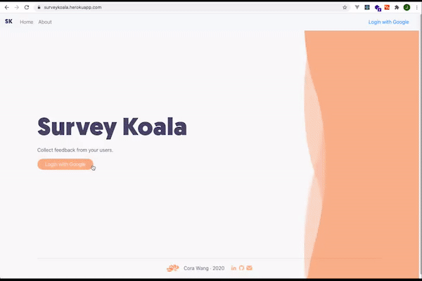

# SurveyKoala
#### Author: Cora Wang
Last Update: Sep 2020

Full-stack web app sending out surveys with React &amp; Redux in the frontend and Node.js, Express, MongoDB in the backend

Major dependencies used:

```passport``` - for identity authorization.

```passport-google-oauth20``` - for google oauth

```cookie-session``` - for storing user identity through cookies

```stripe``` - for credit card payment

```send-grid``` - for email sending API

```mongoose``` - for database connection

```express``` - as our main web server

```lodash``` - for syntactical simplification

```url, body-parser``` - for cleaning up messy json response and parsing url from API calls

#### Demo


The app is available at [SurveyKoala](https://surveykoala.herokuapp.com) for demonstration purpose.


#### Notes
* Because this is a fun personal side project for me, the email address I listed as the sender's email is currently my personal email account. 
Therefore, please do not send tons of junk emails to abuse this feature. Watch the demo to learn how it works!
* I used the test version of Stripe API which won't really charge any money. 
